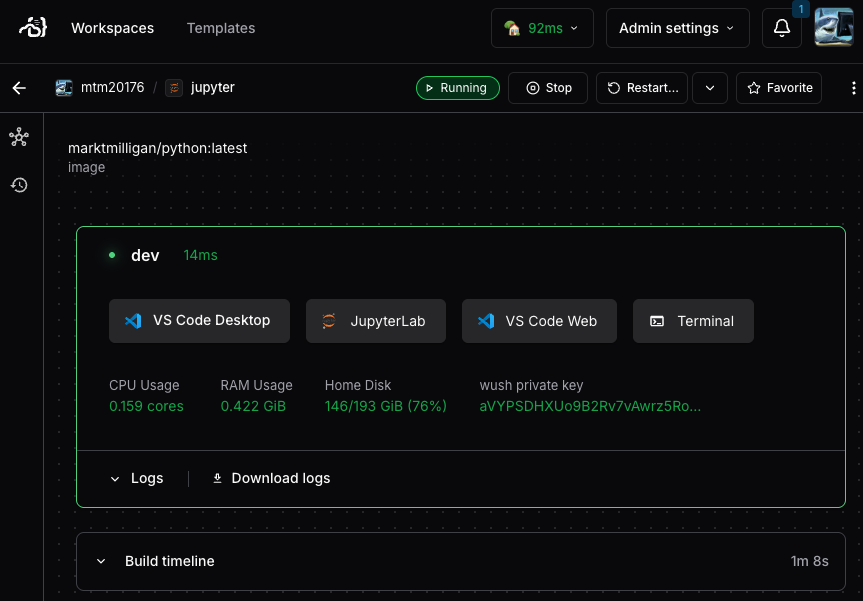
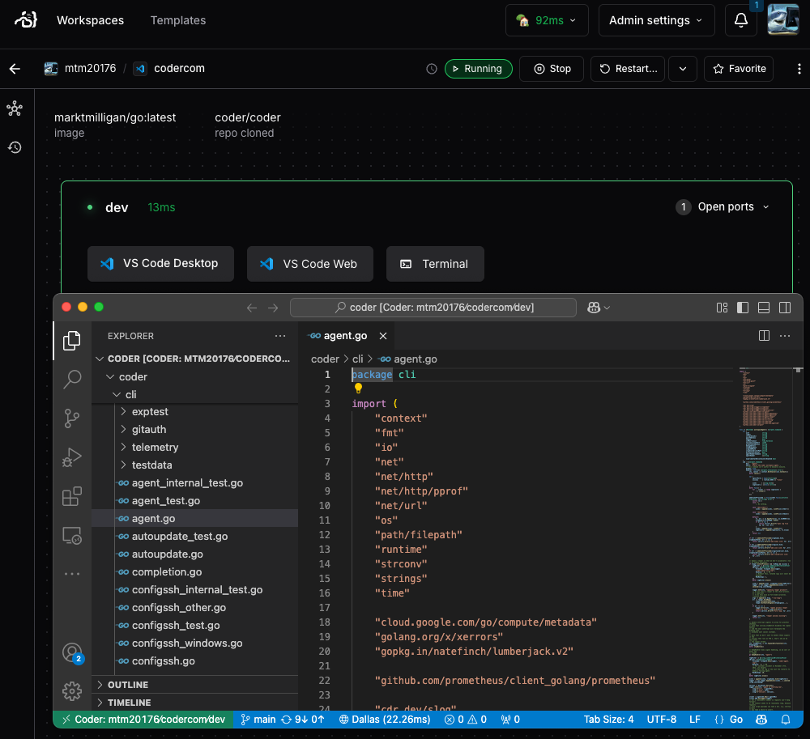
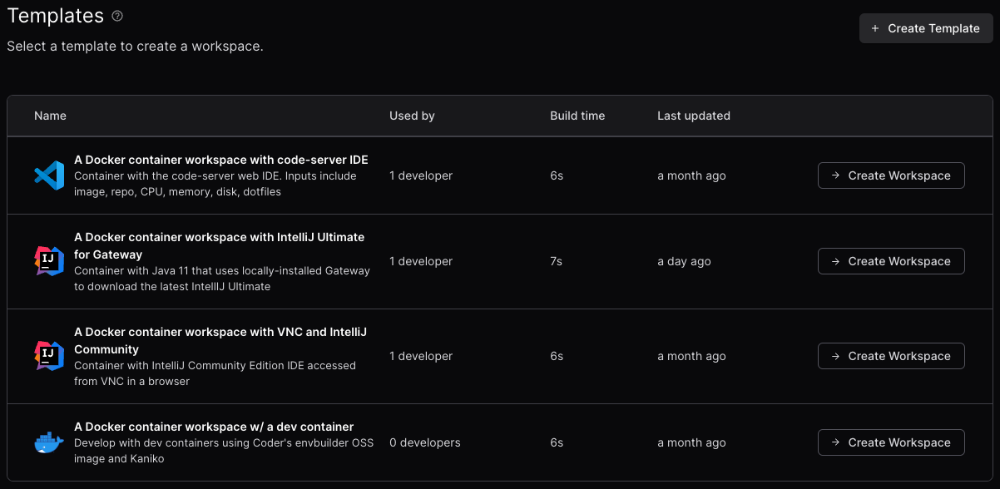

# Coder OSS help

## Changelog

See the [CHANGELOG.md](CHANGELOG.md) file for the latest updates and changes to this project.

## Summary

> I am [no longer with Coder](https://markmilligan.io/experience) so only maintain a handful of Docker-based templates for my own development needs. All the best with your Coder journey!

If you're looking for an v2 trial key, fill out this [form](https://coder.com/trial) for a 30-day trial or you can sign up when creating your admin user after deploying Coder.

If you want to install and manage Coder deployments with [Nuon](https://nuon.co), check out the blog post [here](https://nuon.co/blog/installing-coder-with-nuon/).

Here is an additional repo [coder-hw](https://github.com/sharkymark/coder-hw) with a Python-based CLI using the Coder API.

The [official v2 docs](https://github.com/coder/coder/tree/main/docs) and [template examples](https://github.com/coder/coder/tree/main/examples/templates) are great resources too. Also my colleague [bpmct](https://github.com/bpmct/coder-templates) authors some amazing templates too.



## Coder-maintained templates and modules

I recommend using Coder-maintained templates and modules in the [Coder Registry](https://registry.coder.com/).

## Deprecated templates

Within the `src\templates` directory, you'll find the handful of Docker-based templates that I use personally. Any other templates in the `notmaintained` directory are no longer maintained but you'll welcome to use them as a reference.

## API examples

You can find API endpoints from inspecting the UI in your browser tools. [Here are examples](api.md) to get you going. This new repo [coder-hw](https://github.com/sharkymark/coder-hw) heavily uses the Coder API with a Python-based CLI app.



## Frequently Asked Questions (FAQ)

[Coder's docs](https://github.com/coder/coder/tree/main/docs) are the first place to answers.

## Easiest way to getting started

The easiest and fastest way to run Coder is from the command line with the `coder` binary.

Download it here

```sh
curl -fsSL https://coder.com/install.sh | sh
```

To specify a version and dry run before actually installing

```sh
 curl -L https://coder.com/install.sh | sh -s -- --dry-run --version 2.10.0
```

Using fsS along with L, causes `curl` to fail silently on server errors, preventing showing the progress meter, and still show an error if it fails.

If you're on macOS and not a fan of `brew` like me, make sure you run this command instead:

```sh
curl -fsSL https://coder.com/install.sh | sh -s -- --method standalone
```

> BTW, the coder binary is also the Coder CLI, which you use to create, push templates, even create, start, stop workspaces, API Key tokens, etc.

You can pass parameters/flags after `coder server` but I have a nice [`coder.yaml`](./standalone-yaml/coder.yaml) to easily tweak settings.

```sh
coder server --config coder.yaml
```

## Templates

The example templates that ship with v2 are [here](https://github.com/coder/coder/tree/main/examples/templates) and [bpmct](https://github.com/bpmct/coder-templates) has some sweet templates too like podman and nifty AWS VM template that only persists the home volume.



## License

This project is licensed under the [MIT License](LICENSE)

## Contributing

### Disclaimer: Unmaintained and Untested Code

Please note that this program is not actively maintained or tested. While it may work as intended, it's possible that it will break or behave unexpectedly due to changes in dependencies, environments, or other factors.

Use this program at your own risk, and be aware that:

1. Bugs may not be fixed
1. Compatibility issues may arise
1. Security vulnerabilities may exist

If you encounter any issues or have concerns, feel free to open an issue or submit a pull request.
