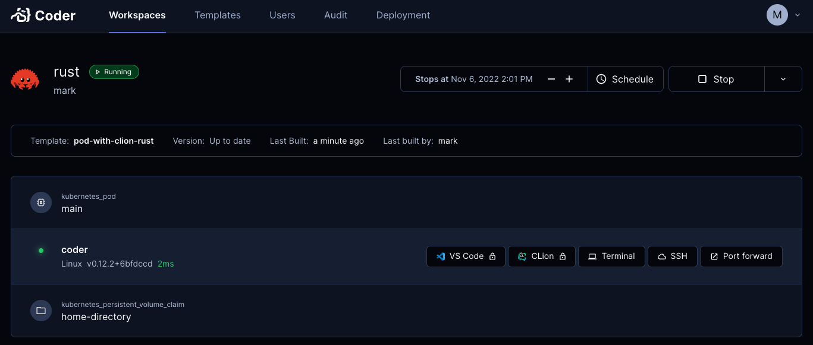

# v2 OSS and Enterprise FAQ

[Coder's docs](https://github.com/coder/coder/tree/main/docs) are the primary
source of truth for installing, configuring and using Coder.

But I come across commonly asked questions or tricky scenarios where these tips
may get you unstuck and help you out. Good luck! 🥳 



<details>
    <summary>How to add an enterprise license</summary>
<br/>

Contact sales@coder.com to get a v2 enterprise trial key.

<br/>

> Install your Coder CLI and server to the latest release

<br/>

If the license is a text string


```sh    
coder licenses add -l 1f5...765
```

If the license is in a file

```sh
coder licenses add -f <path/filename>
```

</details>

<details>
    <summary>I installed Coder, created a workspace but the icons do not load</summary>
<br/>

An important concept to understand is that Coder creates workspaces which have
an agent that must be able to reach the `coder server`.

If the `CODER_ACCESS_URL` is not accessible from a workspace, the workspace may
build, but the agent cannot reach Coder, and thus the missing icons. e.g.,
Terminal, IDEs, Apps.

<br/>

> By default, `coder server` automatically creates an Internet-accessible
> reverse proxy so that workspaces you create can reach the server. 

<br/>

If you are doing a standalone install, e.g., on a Macbook and want to build
workspaces in Docker Desktop, everything is self-contained and workspaces
(containers in Docker Desktop) can reach the Coder server.


```sh    
coder server --access-url http://localhost:3000 --address 0.0.0.0:3000
```

> Even `coder server` which creates a reverse proxy, will let you use
> http://localhost to access Coder from a browser.


</details>

<details>
    <summary>I updated a template, and an existing workspace based on that template fails to start.</summary>
<br/>

I used to be a big fan of input variables in my templates e.g., prompt the user
to choose a [code-server](https://github.com/coder/code-server) [VS
Code](https://code.visualstudio.com/) IDE release, a [container
image](https://hub.docker.com/u/codercom), a [VS Code
extension](https://marketplace.visualstudio.com/vscode). But you have to
understand if you remove any of those values in a template, existing workspaces
that use those removed values will fail to start since the Terraform state will
not be in sync with the new template.

But there's little known CLI sub-command called `update` that will re-prompt the
user to re-enter the input variables thus saving your workspace from a failed
status.

```sh    
coder update --always-prompt <workspace name>
```

</details>

<details>
    <summary>I'm running coder on a VM with systemd but latest release installed isn't showing up.</summary>
<br/>

One of my Coder deployments is a 2 shared vCPU systemd service.

When I upgrade to the latest release, you need to reload the daemon then restart
the Coder service. This ensures the `systemd` daemon does not try to reference
to previous Coder release service since the unit file has changed.

```sh    
curl -fsSL https://coder.com/install.sh | sh
sudo systemctl daemon-reload
sudo systemctl restart coder.service
```

</details>

<details>
    <summary>I'm using the built-in Postgres database and forgot admin email I set up.</summary>
<br/>

1. Run the following `coder server` to retrieve the `psql` connection URL which
   includes the database user and password.
2. `psql` into Postgres, and do a select query on the `users` table.
3. Restart the `coder server`, pull up the Coder UI and log in (hope you
   remembered your password 😆)

```sh    
coder server postgres-builtin-url
psql "postgres://coder@localhost:53737/coder?sslmode=disable&password=I2S...pTk"
```

</details>

<details>
    <summary>How to find out Coder's latest Terraform provider version?</summary>
<br/>

[Coder is on the HashiCorp's TerraForm
registry](https://registry.terraform.io/providers/coder/coder/latest). Check
this frequently to make sure you are on the latest version.

Sometimes you can notice the version has changed and `resource` configurations
have either been deprecated or new ones added when you get warnings or errors
creating and pushing templates.

</details>

<details>
    <summary>How can I set up TLS for my deployment and not create a signed certificate?</summary>
<br/>

Caddy is an easy-to-configure reverse proxy that also automatically creates certificates from Let's Encrypt. [Install docs here](https://caddyserver.com/docs/quick-starts/reverse-proxy) You can start Caddy as a systemd service.

The Caddyfile configuration will like this where 127.0.0.1:3000 is your `CODER_ACCESS_URL`:

```sh
coder.example.com {

	reverse_proxy 127.0.0.1:3000

	tls {
		issuer acme {
			email mark@example.com		
		}		
	}

}
```

</details>

<details>
    <summary>I'm using Caddy as my reverse proxy in front of Coder. How do I set up a wildcard domain for port forwarding?</summary>
<br/>

You need to give Caddy your DNS provider's credentials to create wildcard certificates. This involves building the Caddy binary [from source](https://github.com/caddyserver/caddy) with the DNS provider plugin added. e.g., [Google Cloud DNS provider here](https://github.com/caddy-dns/googleclouddns) 

You will need to add Go to your host running Coder to compile Caddy. Then replace the existing Caddy binary in `usr/bin` and restart the Caddy service.

The updated Caddyfile configuration will like this:

```sh
*.coder.example.com, coder.example.com {

	reverse_proxy 127.0.0.1:3000

	tls {
		issuer acme {
			email mark@example.com
			dns googleclouddns {
				gcp_project my-gcp-project
			}			
		}		
	}

}
```

</details>