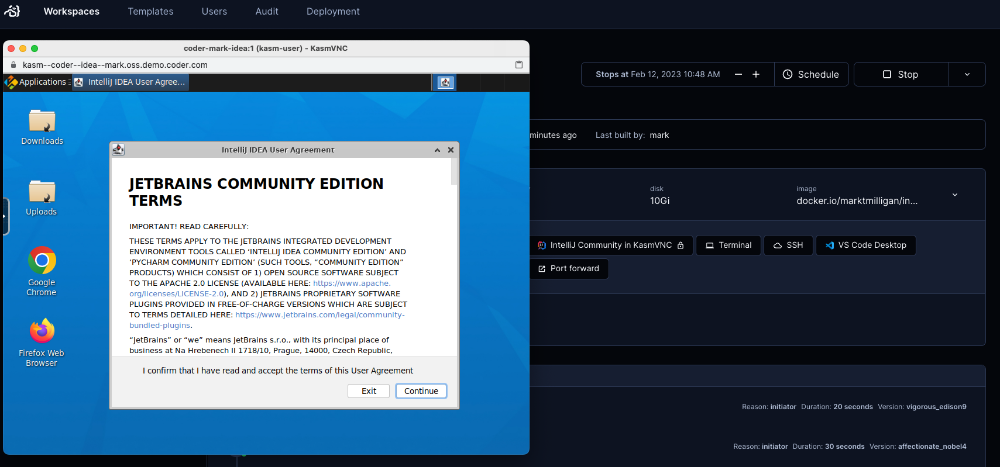

# KasmVNC template with IntelliJ IDEA Community IDE in K8s

### Purpose

JetBrains recommends [Gateway](https://www.jetbrains.com/remote-development/gateway/) as their solution to access IDEs in a remote container or VM. Unfortunately Gateway requires a paid JetBrains license like IntelliJ IDEA Ultimate. If an enterprise uses IntelliJ IDEA Community, Gateway is not an option.

The template uses KasmVNC for remote web-based access to the Coder workspace and the IntelliJ IDEA Community IDE.

### Apps included

1. A web-based terminal
1. JDK `11`, Maven `3.9.0`, Gradle `7.6`
1. IntelliJ IDEA Community Edition `2022.3.2`
1. KasmVNC `1.12.0`

### Container image contents

1. KasmVNC (as the parent image)
1. Baseline packages like htop, curl, python3, sudo, vim, wget, rsync
1. JDK 11
1. JetBrains IntelliJ IDEA Community (`2022.3.2` as of 2023-02-11 docker push)
1. [Maven](https://maven.apache.org/index.html) `.3.9.0`
1. [Gradle](https://gradle.org/) `7.6`

[Dockerfile](https://github.com/sharkymark/dockerfiles/tree/main/intellij-idea/kasm)

[DockerHub](https://hub.docker.com/repository/docker/marktmilligan/intellij-community-kasm/general)

### Additional bash scripting

1. Prompt user and clone/install a dotfiles repository (for personalization settings)
1. Clone a [sample Java source code repo](https://github.com/iluwatar/java-design-patterns)
1. Start KasmVNC and run in background so IntelliJ can start
1. Start Intellij IDEA Community IDE

### Important Notes

1. The IntelliJ IDEA Community Edition Terms UI does not show the checkbox to accept the terms. It is there, just click to the left of the `I confirm` words and you will see the `Continue` button become active to proceed.
1. The `coder_agent` `startup_script` sets `sleep` for 10 seconds after start KasmVNC to ensure it is running before IntelliJ starts, or IntelliJ may fail to load.

### Authentication

This template will use a service account to authenticate to a Kubernetes cluster on GCP

Be sure to change the workspaces_namespace variable in the template creation to the Kubernetes namespace the workspace will be deployed to

### Resources

[VNC Dockerfile](https://github.com/coder/enterprise-images/tree/main/images/vnc)

[KasmVNC](https://www.kasmweb.com/)

[KasmVNC GitHub repo](https://github.com/kasmtech/KasmVNC)

[IntelliJ Downloads](https://www.jetbrains.com/idea/download/#section=mac/)

[KasmVNC Credits: Ben Potter](https://github.com/bpmct/coder-templates/tree/main/better-vnc)
